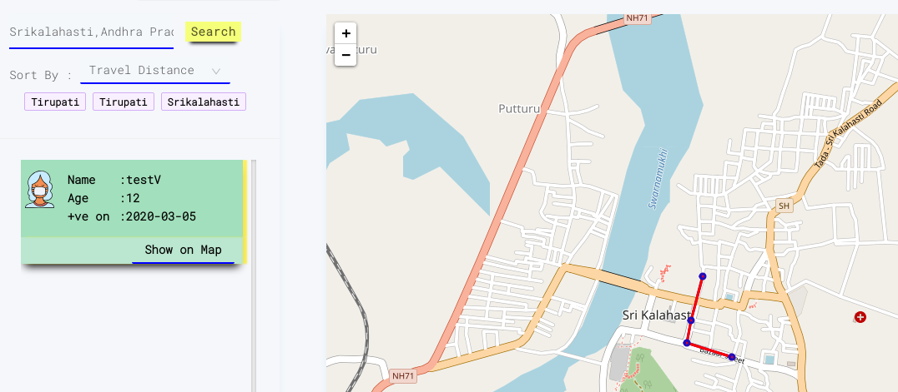
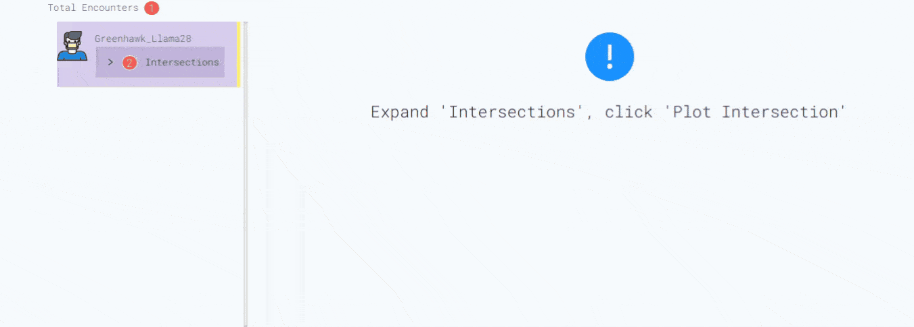
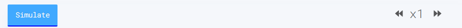
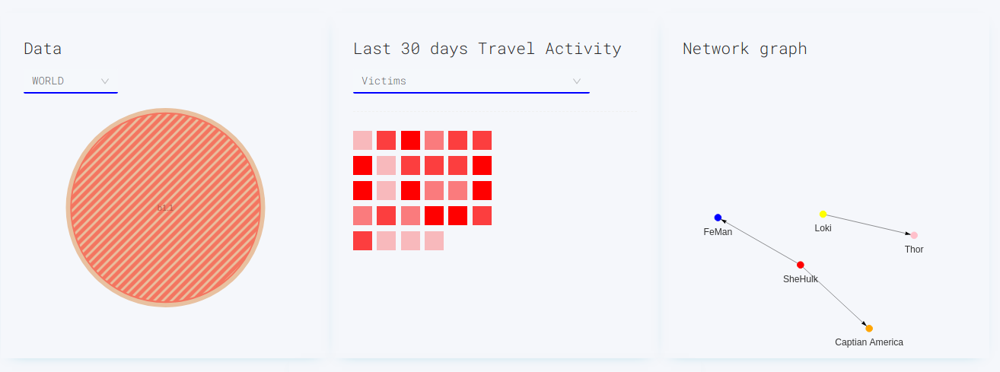
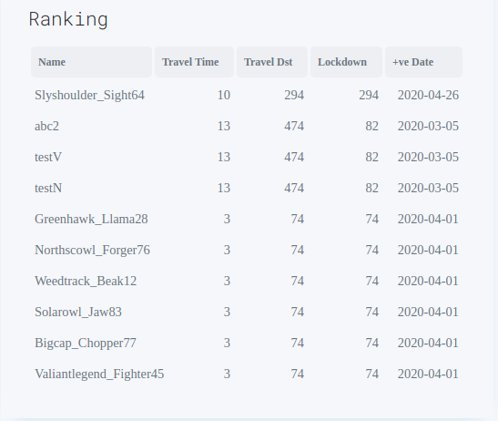

# plotKovid19

A site which will track and trace the covid-19 victims location data.

## **Features**

### **1.Plot**

This page gives the covid-19 cases information about the searched place.This results the list of victims who falls in that place and their movement history.Users can see the plotted graph from the victim's google timeline data.

### **2.Intersect**

This page gives the information whether the current(logged in) user have met with covid-19 victims/symptoms.This can be achieved by comparing users 'Google Timeline' data against the victim's timeline data, considering the both are only hours apart (time is taken into consideration). This will also provides information even if user have multiple interactions with single victim.

There is a speed factor,which will simulate the points faster by speeding up the time

### **3.Stats**

This page gives the information regarding covid-19 from different sources and from the app itself, a 'Dashboard'.(still more to add)

## **F.A.Q**

**How can this site have users location data ?**

> Every location data in site are willing uploaded by users. No location data is being uploaded to site until or unless getting acceptance from user.

**Can I see all users location data?**

> No , only you can see the location data of users who are listed under victims/symptoms category.

**Do I need to give my actual name ?**

> No , username will be randomly chosen from the site while registering. you may need to note it for subsequent logins.

**Can I delete my data?**

> Yes

**How can I know data uploaded by victim is valid ?**

> We have 'Peer reviewed' option , using this users in location living nearby victims can report whether it's valid or invalid one. (under development)

**How can I upload my location data ?**

> Go to [https://www.google.com/maps/timeline](https://www.google.com/maps/timeline) and select individual dates (upto min 2 weeks).After selecting click 'Gear Icon' , then you find a option 'Export this day to KML'.By clicking this , will download a KML(file format) file. Once all the individual files downloaded , upload all the KML files during signup process.
